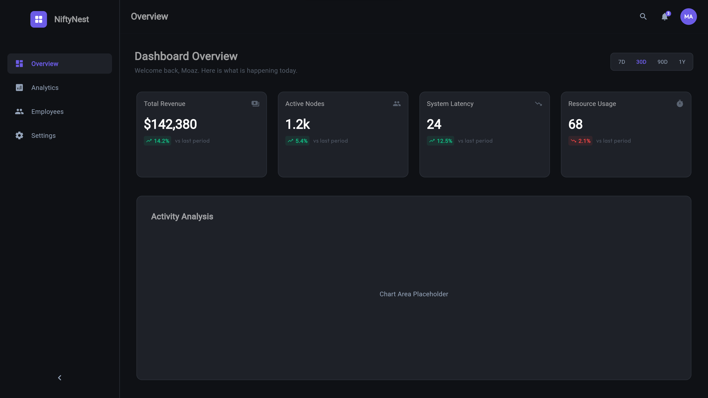
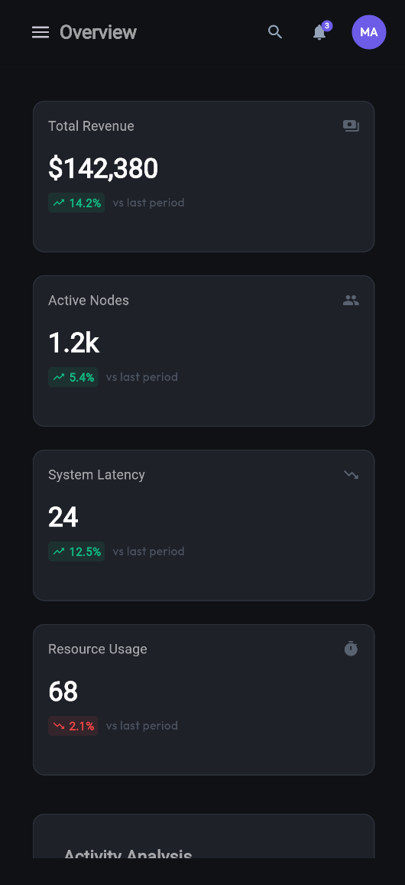
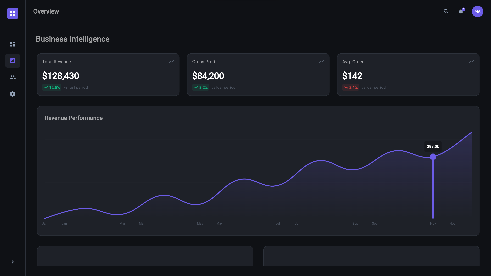
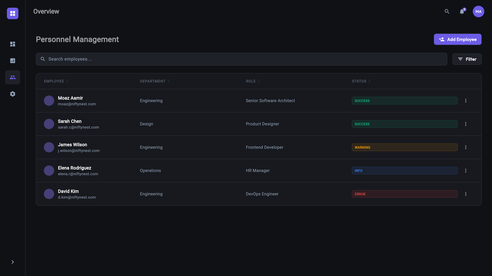
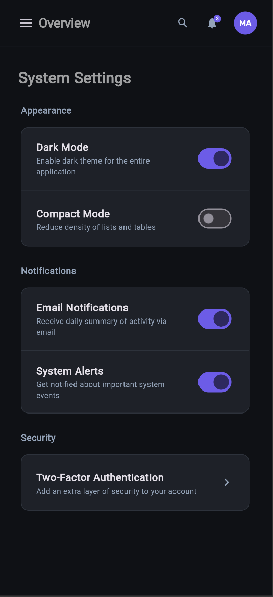
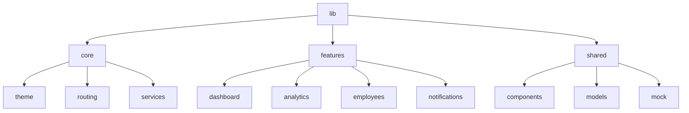

# NiftyNest Flutter Architecture

A portfolio-grade Enterprise SaaS dashboard architecture demonstrating scalable engineering patterns, premium design systems, and advanced state management in Flutter.

[](https://flutter.dev)
[](https://riverpod.dev)
[](https://opensource.org/licenses/MIT)

## 🏗️ Architectural Philosophy

NiftyNest is built on a **Feature-First Architecture**, prioritizing modularity, scalability, and strict separation of concerns. It is designed to demonstrate how enterprise-level applications should be structured to handle growing complexity without technical debt.

### Core Principles
- **Modularity**: Every feature is self-contained with its own domain, presentation, and application logic.
- **Predictable State**: Powered by **Riverpod**, ensuring reactive UI updates with deterministic state transitions.
- **Design System Tokens**: Centralized tokens for spacing, radius, and typography to maintain visual rhythm across the platform.
- **Operational Realism**: Simulated async data flows and persistent user preferences.

## 📱 Visual Showcase

| Desktop Dashboard | Mobile Responsive |
| :---: | :---: |
|  |  |

### 🔍 Deep Dive

| Analytics System | Operational Feed | Mobile Experience |
| :---: | :---: | :---: |
|  |  |  |

## 📁 Feature-First Structure



## ✨ Engineering Highlights

- **Advanced Command Palette**: `⌘K` driven navigation inspired by Raycast and Linear.
- **Enterprise Data Table**: High-performance sorting, filtering, and responsive row transitions.
- **Real-time Notifications**: A stateful notification center with unread management.
- **Dynamic Theme System**: Persistent Light/Dark mode transitions with zero flicker.
- **Intelligent Analytics**: Professional monochromatic charts with smooth interpolation.
- **Responsive Mastery**: Fluid transitions across Mobile, Tablet, and Desktop breakpoints.
- **Onboarding Experience**: A premium, minimalist first-touch flow for new users.

## 🛠️ Tech Stack

- **Framework**: Flutter 3.x (Latest Stable)
- **State Management**: [Riverpod](https://riverpod.dev) (Notifiers & AsyncNotifiers)
- **Navigation**: [GoRouter](https://pub.dev/packages/go_router)
- **Persistence**: [Shared Preferences](https://pub.dev/packages/shared_preferences)
- **Visuals**: [fl_chart](https://pub.dev/packages/fl_chart), [Google Fonts](https://pub.dev/packages/google_fonts), [Shimmer](https://pub.dev/packages/shimmer)
- **Typography**: Outfit (Premium Display) & Inter (UI Body)

## 🚀 Deployment (Web)

This project is optimized for Flutter Web deployment with canvaskit and wasm support.

```bash
# Build for web
flutter build web --release --web-renderer canvaskit
```

### Hosting Recommendations
- **Vercel**: Best for CI/CD integration.
- **Firebase Hosting**: Native Flutter integration.
- **GitHub Pages**: Ideal for open-source showcase.

## 📈 Scalability Philosophy

NiftyNest is not just a UI; it is a **system**. By strictly separating state logic from the UI and using centralized design tokens, the application can scale from 5 to 50+ features with minimal friction. The use of Riverpod Notifiers ensures that as the app grows, data consistency remains intact across multiple complex features.

## 📄 License

This project is licensed under the MIT License - see the [LICENSE](LICENSE) file for details.

---

Built with ❤️ by **Moaz Aamir** — Lead Engineer
[GitHub](https://github.com/MoazAamir) | [LinkedIn](https://linkedin.com/in/moazaamir)
